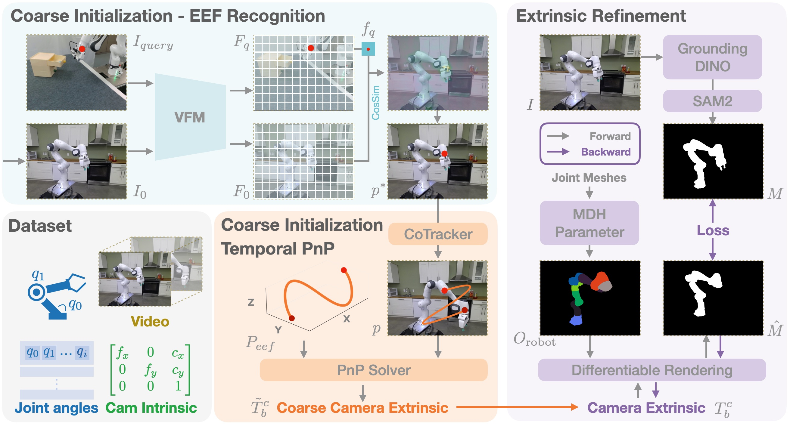

<div align="center">

# CalibAll

### Stable Offline Hand-Eye Calibration for any Robot with Just One Mark

<a href="https://arxiv.org/abs/2511.17001">
    
</a>
<a href="https://sii-dannyxsc.github.io/CalibAll/">
    
</a>
<a href="LICENSE">
    
</a>

**Sicheng Xie, Lingchen Meng, Zhiying Du, Shuyuan Tu, Haidong Cao, Jiaqi Leng, [Zuxuan Wu](https://zxwu.azurewebsites.net/)<sup>&dagger;</sup>, Yu-Gang Jiang**

<sup>&dagger;</sup> Corresponding author

</div>

## Method

<p align="center">
  
</p>

## Demo

<p align="center">
  
</p>

## Supported Robots & Datasets

**Robot Arms:** Franka Panda, UR5e, FR3, xArm7

**Grippers:** Panda Hand, Robotiq 85

**Dual-Arm Systems:** ALOHA, ARX5

**Datasets:**
| Dataset | Config |
|---------|--------|
| Berkeley Autolab UR5 | `berkeley_autolab_ur5.yaml` |
| DROID | `droid.yaml` |
| NYU Franka | `nyu_franka.yaml` |
| RoboMind (Franka / UR5e / ALOHA) | `robomind_franka.yaml` / `robomind_ur5e_1rgb.yaml` / `robomind_aloha.yaml` |
| RDT ALOHA | `rdt_aloha.yaml` |
| TOTO | `toto.yaml` |
| UCSD Kitchen | `ucsd_kitchen.yaml` |
| UTokyo xArm | `utokyo_xarm.yaml` |
| Non-Prehensile | `nonprehensile.yaml` |

## Installation

### 1. Create Environment

```bash
conda create -n caliball python=3.12 -y
conda activate caliball
conda install ffmpeg -y
```

### 2. Install PyTorch (CUDA 12.8)

```bash
pip install torch==2.9.0 torchvision==0.24.0 torchaudio==2.9.0 --index-url https://download.pytorch.org/whl/cu128
```

### 3. Install Base Dependencies

```bash
pip install -r requirements.txt
```

### 4. Install Special Dependencies

**LeRobot:**
```bash
pip install git+https://github.com/huggingface/lerobot.git@0cf864870cf29f4738d3ade893e6fd13fbd7cdb5
```

**nvdiffrast:**
```bash
pip install setuptools wheel ninja
pip install git+https://github.com/NVlabs/nvdiffrast.git --no-build-isolation
```

**PyTorch3D:**
```bash
pip install --extra-index-url https://miropsota.github.io/torch_packages_builder pytorch3d==0.7.9+pt2.9.0cu128
```

**MoGe:**
```bash
pip install git+https://github.com/microsoft/MoGe.git
```

### 5. Install Third-Party Models

```bash
mkdir -p third_party && cd third_party

# Co-Tracker
git clone https://github.com/facebookresearch/co-tracker
cd co-tracker && pip install -e . && cd ..

# SAM3
git clone https://github.com/facebookresearch/sam3.git
cd sam3 && pip install -e . && cd ..

# DINOv2
git clone https://github.com/facebookresearch/dinov2

# URDF Files
git clone https://github.com/Daniella1/urdf_files_dataset.git

cd ..
```

### 6. Download Checkpoints

Place model checkpoints under `ckpt/`:
```
ckpt/
├── dinov2/
│   └── dinov2_vitb14_pretrain.pth
├── cotracker/
│   └── scaled_offline.pth
└── sam3/
    └── sam3.pt
```

## Usage

### Run Calibration

```bash
PYTHONPATH=. python scripts/label_from_config.py \
    --config src/caliball/config/berkeley_autolab_ur5.yaml \
    --output_dir ./label_out/berkeley_autolab_ur5
```

Replace the config file with any supported dataset config from `src/caliball/config/`.

### Visualize Results

```bash
PYTHONPATH=. python scripts/visualize_labels.py \
    --label_dir ./label_out/berkeley_autolab_ur5
```

## Project Structure

```
CalibAll/
├── src/caliball/
│   ├── config/          # Hydra configs for datasets and robots
│   ├── dataset/         # Dataset loaders
│   ├── pipeline/        # Processing pipeline (recognition, tracking, PnP, rendering)
│   ├── robot/           # Robot models (FK, URDF, composites, dual-arm)
│   ├── utils/           # Utilities (rendering, feature extraction, 3D ops)
│   ├── coarse_init.py   # Coarse initialization
│   ├── refinement.py    # Refinement optimization
│   ├── label.py         # Labeling and annotation
│   └── eef_pose.py      # End-effector pose computation
├── scripts/             # Entry-point scripts
├── assets/              # Images and demos for README
├── requirements.txt
└── LICENSE
```

## Citation

```bibtex
@article{xie2024caliball,
    title={Stable Offline Hand-Eye Calibration for any Robot with Just One Mark},
    author={Xie, Sicheng and Meng, Lingchen and Du, Zhiying and Tu, Shuyuan and Cao, Haidong and Leng, Jiaqi and Wu, Zuxuan and Jiang, Yu-Gang},
    journal={arXiv preprint arXiv:2511.17001},
    year={2024}
}
```

## License

This project is licensed under the MIT License - see the [LICENSE](LICENSE) file for details.
