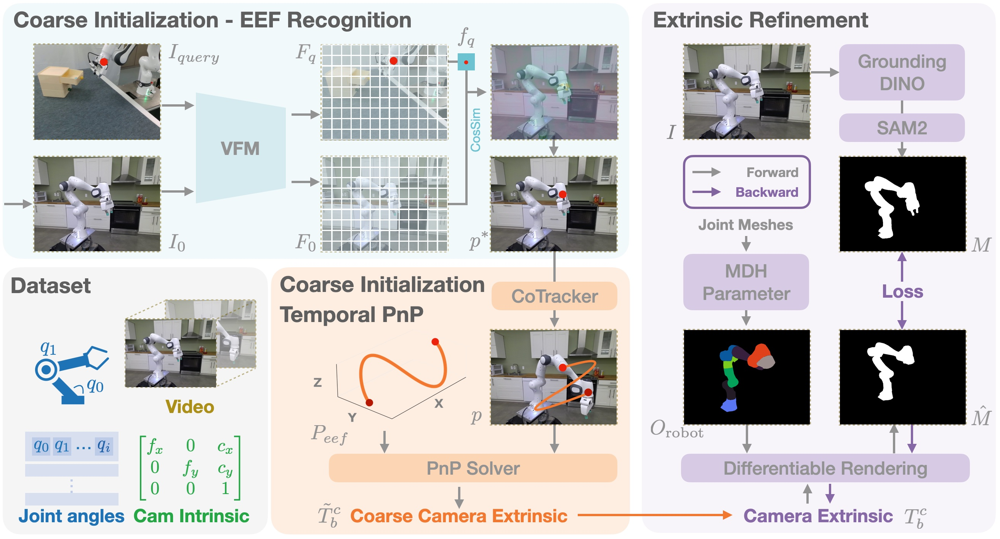
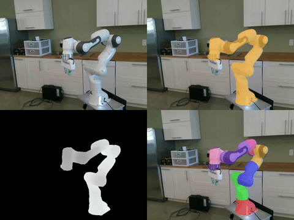

<div align="center">

# CalibAll

### Unify Robot Actions in Camera Frame

<a href="https://arxiv.org/abs/2511.17001">
    
</a>
<a href="https://sii-dannyxsc.github.io/CalibAll/">
    
</a>
<a href="LICENSE">
    
</a>
<a href="README.md">
    
</a>

**谢思成<sup>1,2,3</sup>, 孟凌晨<sup>3</sup>, 刁子杰<sup>1</sup>, 曹海东<sup>1</sup>, 杜之颖<sup>1</sup>, 涂舒媛<sup>1</sup>, 冷嘉琪<sup>1</sup>, 王秋月<sup>3</sup>, 李明晟<sup>3</sup>, 白帅<sup>3</sup>, [吴祖煊](https://zxwu.azurewebsites.net/)<sup>1,2,&dagger;</sup>, 江宇刚<sup>1,&dagger;</sup>**

<sup>1</sup> 复旦大学可信具身智能研究所 &nbsp; <sup>2</sup> 上海创新研究院 &nbsp; <sup>3</sup> 阿里巴巴 Qwen 团队

<sup>&dagger;</sup> 通讯作者

</div>

## 亮点

- **统一跨具身动作表示** — 将异构机器人动作转换为相机坐标系下的标准化表示，在单臂和双臂机器人间保持一致的几何语义
- **免训练标定** — 与机器人无关的粗到精流水线：时序 PnP 初始化 + 可微渲染优化，无需机器人特定训练数据
- **16 个数据集，4 个平台，约 97K episodes** — 预配置 Franka、UR5e、xArm7、ALOHA 等，生成标准化 TCP 位姿动作和辅助标注
- **Web 交互式界面** — 点击式工作流，支持 SAM3 自动检测、DINOv2 追踪、实时 Pipeline 可视化

## 方法

<p align="center">
  
</p>

## 演示

<p align="center">
  
</p>

## 支持的机器人与数据集

**机械臂：** Franka Panda, UR5e, xArm7

**夹爪：** Panda Hand, Robotiq 85, xArm Gripper

**双臂系统：** ALOHA (Cobot Magic), ARX5 (RobotWin)

| 数据集 | 机器人 | 配置文件 |
|--------|--------|----------|
| Berkeley Autolab UR5 | UR5e + Robotiq | `berkeley_autolab_ur5.yaml` |
| DROID | Franka + Robotiq | `droid.yaml` |
| NYU Franka | Franka + Panda Hand | `nyu_franka.yaml` |
| RoboMIND Franka | Franka + Robotiq | `robomind_franka.yaml` |
| RoboMIND UR5e | UR5e + Robotiq | `robomind_ur5e_1rgb.yaml` |
| RoboMIND ALOHA | ALOHA | `robomind_aloha.yaml` |
| RDT ALOHA | ARX5 | `rdt_aloha.yaml` |
| TOTO | Franka + Panda Hand | `toto.yaml` |
| UCSD Kitchen | xArm7 | `ucsd_kitchen.yaml` |
| UTokyo xArm | xArm7 | `utokyo_xarm.yaml` |
| Non-Prehensile | Franka | `nonprehensile.yaml` |

## 安装

### 1. 创建环境

```bash
conda create -n caliball python=3.12 -y
conda activate caliball
conda install ffmpeg -y
```

### 2. 安装 PyTorch (CUDA 12.8)

```bash
pip install torch==2.9.0 torchvision==0.24.0 torchaudio==2.9.0 --index-url https://download.pytorch.org/whl/cu128
```

### 3. 安装 CalibAll

```bash
git clone https://github.com/SII-dannyXSC/CalibAll.git
cd CalibAll
pip install -e .
pip install -r requirements.txt
```

### 4. 安装特殊依赖

```bash
# nvdiffrast
pip install setuptools wheel ninja
pip install git+https://github.com/NVlabs/nvdiffrast.git --no-build-isolation

# PyTorch3D
pip install --extra-index-url https://miropsota.github.io/torch_packages_builder pytorch3d==0.7.9+pt2.9.0cu128

# MoGe
pip install git+https://github.com/microsoft/MoGe.git
```

### 5. 克隆第三方仓库

```bash
mkdir -p third_party && cd third_party

# Co-Tracker（点追踪）
git clone https://github.com/facebookresearch/co-tracker
cd co-tracker && pip install -e . && cd ..

# SAM3（分割）
git clone https://github.com/facebookresearch/sam3.git
cd sam3 && pip install -e . && cd ..

# DINOv2（特征提取）
git clone https://github.com/facebookresearch/dinov2

# 机器人 URDF 和 mesh 文件
git clone https://github.com/Daniella1/urdf_files_dataset.git urdf

cd ..
```

### 6. 下载模型权重

将模型权重放在 `ckpt/` 目录下：
```
ckpt/
├── dinov2/
│   └── dinov2_vitb14_pretrain.pth
├── cotracker/
│   └── scaled_offline.pth
└── sam3/
    └── sam3.pt
```

## 快速开始

### Web UI（推荐）

启动交互式标定界面：

```bash
python scripts/caliball_web.py
```

浏览器打开 `http://127.0.0.1:8765`，流程如下：

1. **配置** — 输入数据集路径，扫描相机，选择数据集配置和机器人类型
2. **标注** — 选择帧范围，设置追踪点（支持 DINOv2 自动检测），绘制掩码（支持 SAM3 自动检测）
3. **Pipeline** — 自动执行追踪、粗估 PnP、可微优化
4. **下载** — 获取内参/外参矩阵和标定 YAML 文件

可选参数：
```bash
python scripts/caliball_web.py --host 0.0.0.0 --port 8765 --device cuda
```

### CLI：批量标注

对整个数据集生成标注：

```bash
python scripts/label.py \
    --config src/caliball/config/berkeley_autolab_ur5.yaml \
    --output_dir ./label_out/berkeley_autolab_ur5
```

### CLI：可视化结果

```bash
python scripts/visualize.py \
    --json_path ./label_out/berkeley_autolab_ur5/episode_000000.json \
    --task_path /path/to/dataset/task_name \
    --output_dir ./label_out/vis
```

### CLI：验证机器人 URDF

检查机器人 mesh 和正运动学配置是否正确：

```bash
python scripts/check_robot_urdf.py \
    --config src/caliball/config/berkeley_autolab_ur5.yaml \
    --output /tmp/robot.ply
```

## 项目结构

```
CalibAll/
├── src/caliball/
│   ├── algorithms/      # DINOv2 识别、CoTracker 追踪、SAM3 分割、PnP 求解
│   ├── config/          # 数据集 YAML 配置和标定文件
│   │   ├── dataset/     # 数据集加载配置（Web UI 使用）
│   │   └── calibration/ # 内外参标定结果
│   ├── dataset/         # LeRobot 数据集读取器 + 状态处理器
│   ├── labeling/        # 位姿计算、掩码渲染、标注编排
│   ├── pipeline/        # CoarseInit + Refinement 流水线
│   ├── rendering/       # NVDiffrast 可微渲染器
│   ├── robots/          # 机器人注册表（正运动学、mesh 路径、组合体）
│   ├── utils/           # 视频 I/O、可视化、mesh 加载
│   └── web/             # Flask Web 应用（路由、服务、模板）
├── scripts/
│   ├── caliball_web.py  # Web UI 入口
│   ├── label.py         # 批量标注流水线
│   ├── visualize.py     # 结果可视化
│   └── check_robot_urdf.py  # 机器人 mesh 验证
├── third_party/         # Co-Tracker, SAM3, DINOv2, nvdiffrast, URDF
├── ckpt/                # 模型权重
└── assets/              # 图片和演示素材
```

## 引用

```bibtex
@article{xie2024caliball,
    title={Stable Offline Hand-Eye Calibration for any Robot with Just One Mark},
    author={Xie, Sicheng and Meng, Lingchen and Du, Zhiying and Tu, Shuyuan and Cao, Haidong and Leng, Jiaqi and Wu, Zuxuan and Jiang, Yu-Gang},
    journal={arXiv preprint arXiv:2511.17001},
    year={2024}
}
```

## 许可证

本项目采用 MIT 许可证 - 详见 [LICENSE](LICENSE) 文件。
